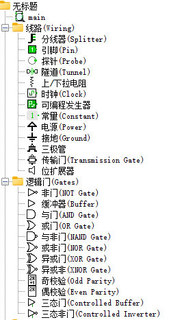
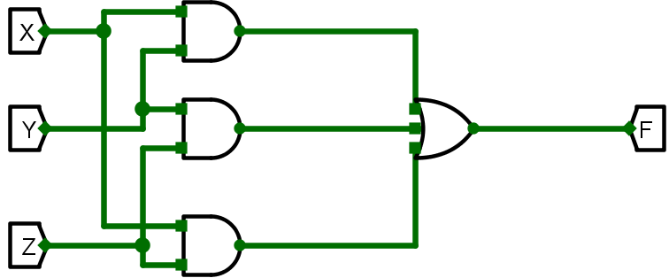
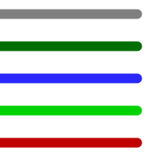
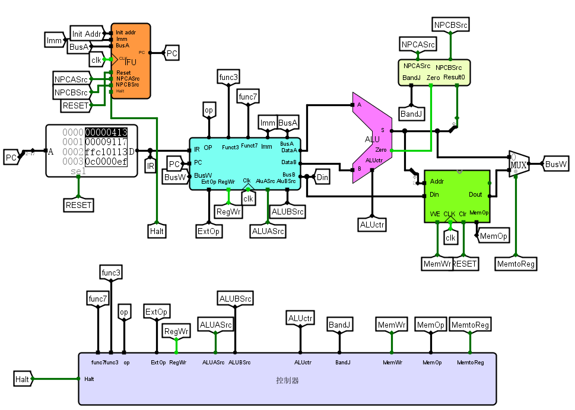
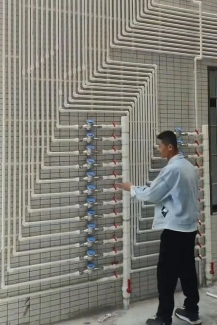

# A bRIEF Lo🐔sim Jiaoxue

欢迎回到 Logisim！

现在将进行玩法教学

位于左侧的元件栏可以任意采购元件，左键可以放置单个元件，**按住 Ctrl/Shift + 右键可以放置多个元件**

让我们先搭建一个简易的 3 输入多数表决器电路，注意不要混淆“引脚”和“隧道”，前者可以产生 0/1 信号，后者只能用来“无线传递”信号

因为 Logisim 的神秘渲染特性，电线可能会进行移动，变色，还会显现，消失（这个时候重启 Logisim 可以解决问题）

让我们把所有元素综合在一起！

现在开始你的 Logisim 之旅吧！

