这里放一些 Logisim tricks

## 在本地搭建 Logisim 实验环境

常见的 Logisim 有三种版本：

1. [Logisim](https://sourceforge.net/projects/circuit/)，更新止步于 2013 年，后面的版本都是它的 Fork
2. [Logisim Italian Fork](https://sourceforge.net/projects/logisimit/)，比较经典的 Fork，似乎是两年一次更新
3. [Logisim-evolution](https://github.com/logisim-evolution/logisim-evolution)，比较前沿的 Fork，有较多的新功能，似乎在持续维护

对于 DLCO 这门课，你应该**<u>选择第二个版本</u>**，选择正确的版本对你在本地调试有很大的帮助（这三个版本的 .circ 文件不完全互通，<del>你也不希望自己在本地连好的实验在评测机上打不开吧嘿嘿</del>）。

具体来说，实训平台用的是 [v2.16.1.3](https://github.com/Logisim-Ita/Logisim/releases/tag/v2.16.1.3) 的版本，个人建议使用最新的 [v2.16.2.2](https://github.com/Logisim-Ita/Logisim/releases/tag/v2.16.2.2) 版本或者在线平台的 [v2.16.1.3](https://github.com/Logisim-Ita/Logisim/releases/tag/v2.16.1.3) 版本，否则后期遇到锁存器和触发器时可能会遇到一些问题（？）

---

## 在实训平台和本地之间传递文件

注意到这里的工具箱了吗

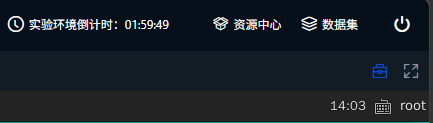

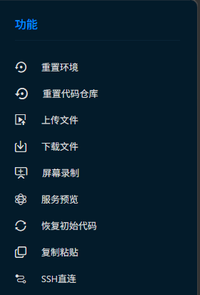

剩下的你都懂了

---

## Logisim Tips

**Logisim 缺乏友好的新手教程，在此推荐 [Logisim 教程 - COD Lab 2026](https://soc.ustc.edu.cn/COD/other/logisim/)**

往届的助教也整理过一个帮助文档：[课内实验操作说明](https://nju-dl-co-ta.github.io/DLCOdoc/)

> 网站使用的 theme 仓库现在 404 了，如果你觉得页面看上去比较难受，可以先用我 Fork 的网站：[课内实验操作说明](https://blog.nopthon.icu/DLCOdoc/)

如果你已经是一个 Logisim 大神了（！？强强？！），[CS 3410 Design Guidelines for Logisim: Bad Practices to Avoid](https://www.cs.cornell.edu/courses/cs3410/2019sp/logisim/logisim_design.html) 这个 Guideline 可能对你的大型工程构建有帮助

除此以外，以下给出一些其他比较好用的小 Tips，或许可以减少在 Logisim 上消耗的时间：

---

- 
<b>选择一个元件，在按住 `Ctrl` 或 `Shift` 的情况下，右键可以放置多个元件</b>

    
    - （比如说你要放置 `x` 个某元件，可以按住 `Shift` 右键放置 `x-1` 个元件，再松开 `Shift` 左键放置最后一个元件）

??? abstract "动图（点击展开后播放）"

    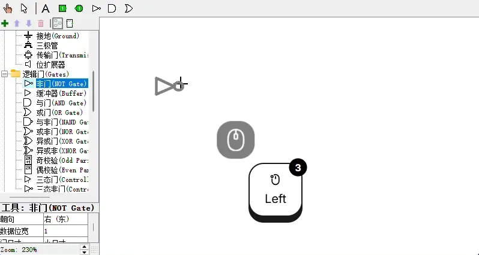

---

- 
<b>选中逻辑门再按下数字键可以切换逻辑门的**输入位宽**（在放置元件时该操作也有效，并且之后放置的门都遵循该设置）；同理可以改变的有“常量”的值（不是位宽）、复用器的**选择端位宽**</b>

在额外按住 `Alt` 的情况下，数字键专门用于改变**数据位宽**，比如运算器、寄存器

此外，你可以多选相同元件，然后批量修改位宽

> 最好自己试一试，以防你分不清按不按住 `Alt` 分别修改的是什么值，以及理解这一条 Tip 在说什么

??? abstract "动图（点击展开后播放）"

    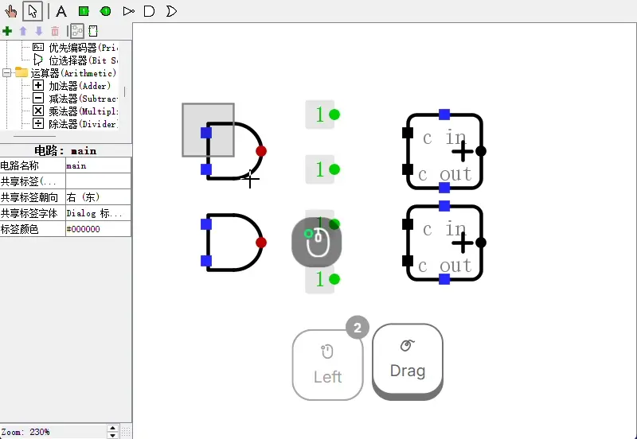

---

- 
<b>放置输入输出引脚后（并且正确为引脚命名），点击 “工程→分析组合逻辑电路” ，可以通过编辑真值表 / 输入逻辑表达式的方式自动生成组合逻辑电路</b>

    
    - **注意到这会覆盖掉原本的电路**，因此更好用的方式是：创建子电路，生成组合逻辑电路，然后封装成模块，进行整体调用
    - 可以参考 [第一周：Logisim 入门 - Verilog Fun](https://www.verilog.fun/pocc/week1-logisim-intro/#2-xxx) 中的内容
    - （说实话，对于 DLCO 实验来说，大概率用不到这个功能）

??? abstract "动图（点击展开后播放）"

    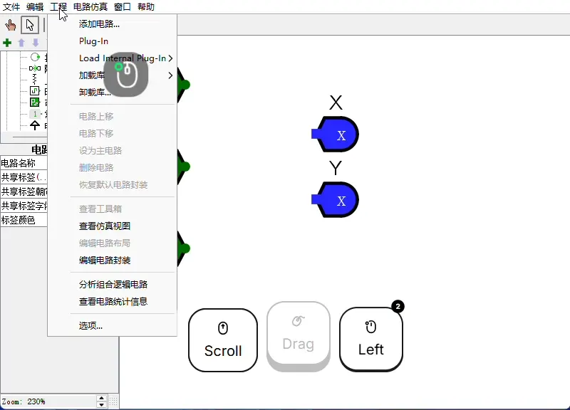

---

- 
<b>如果需要跨文件复制电路，可以点击 “工程→加载库→Logisim库” 导入.circ文件，以整体封装的形式使用电路，也可以在导入后对整个电路复制粘贴（如果你不希望后续的实验存在过多的子电路文件依赖，我建议对整个电路复制粘贴，否则使用封装电路更加简洁）</b>

（这个就不给动图演示了，后续实验就会用到）

---

- 
<b>编辑模式下鼠标中键点击某根电线（或者在戳模式下左键），会加粗与这根电线有连接的所有电线与节点，可以辅助判断有没有发生错误连线</b>

    
    - （比如下面的例子中，同一逻辑门的两个输入不小心连接到了一起）

??? abstract "动图（点击展开后播放）"

    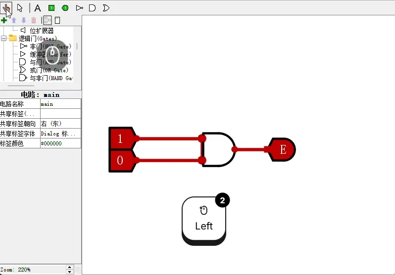

---

- 
<b>选中元件按方向键可以修改元件朝向（多选元件按方向键也有效，但是电线不会相应旋转）</b>

（没有动图的必要）

---

- 
<b>一次 `Ctrl+D` 操作（复制+粘贴）可以代替一轮 `Ctrl+CV` 操作</b>

??? abstract "动图（点击展开后播放）"

    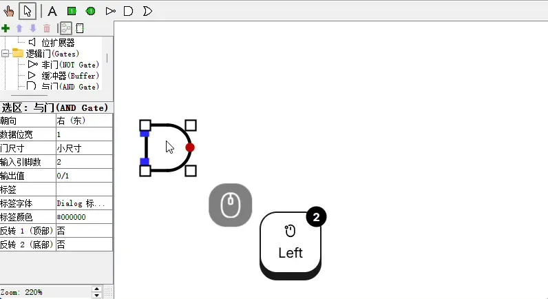

---

- 
<b>Logisim 会主动连接端口，即使之后被分开也会尝试保持电路连接</b>

    
    - 如果你不希望自动连接，**按住 Shift** 并释放左键可以不自动连接（这在你不小心把电路缠在一块的时候很好用）
    - 在“偏好设置 → 电路编辑器”中，可以关闭自动连接的功能

??? abstract "动图（点击展开后播放）"

    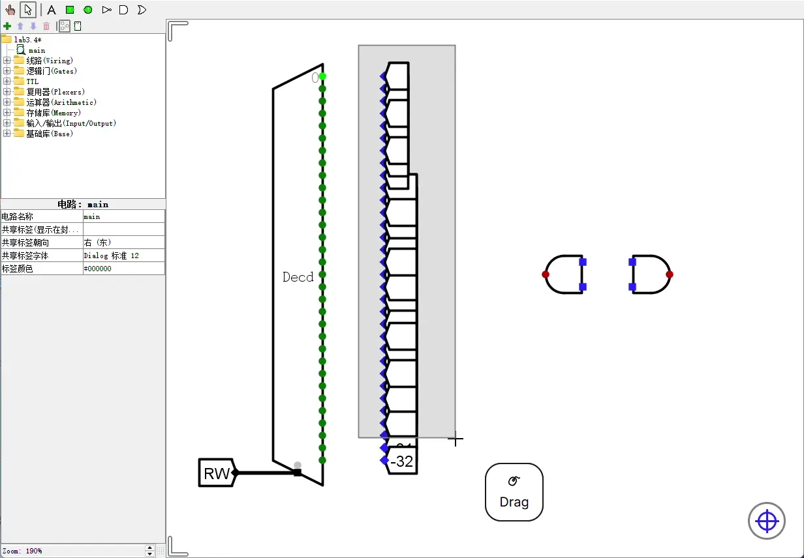

---

- 
<b>按住 Alt 键，在编辑模式下可以不依赖元件放置电线</b>

    
    - 并且你还会发现，按下 Alt 后对电线的处理逻辑不太一样（从新拉电线变成了移动最小段的电线）

??? abstract "动图（点击展开后播放）"

    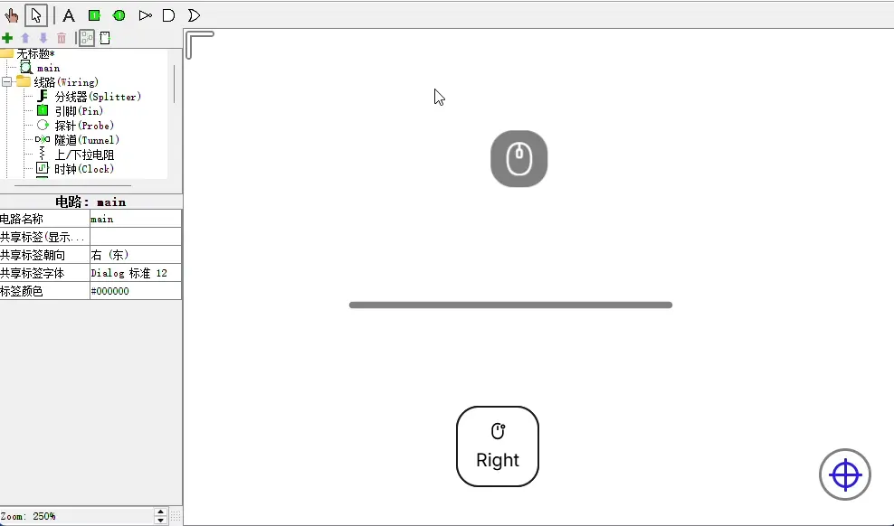

---

- 
<b>这个软件其实是有 Graphics Acceleration 的，可以在这个地方设置图形加速</b>

??? abstract "静图"

    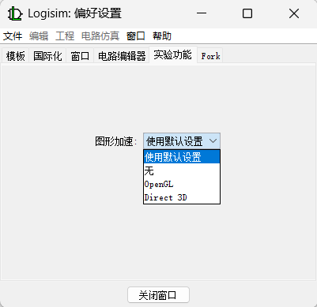

---

- 
<b>你可能很好奇，为什么我上面的截图中没有网格点</b>

    
    - 在这个非常不起眼的地方，可以切换网格点显示

??? abstract "静图"

    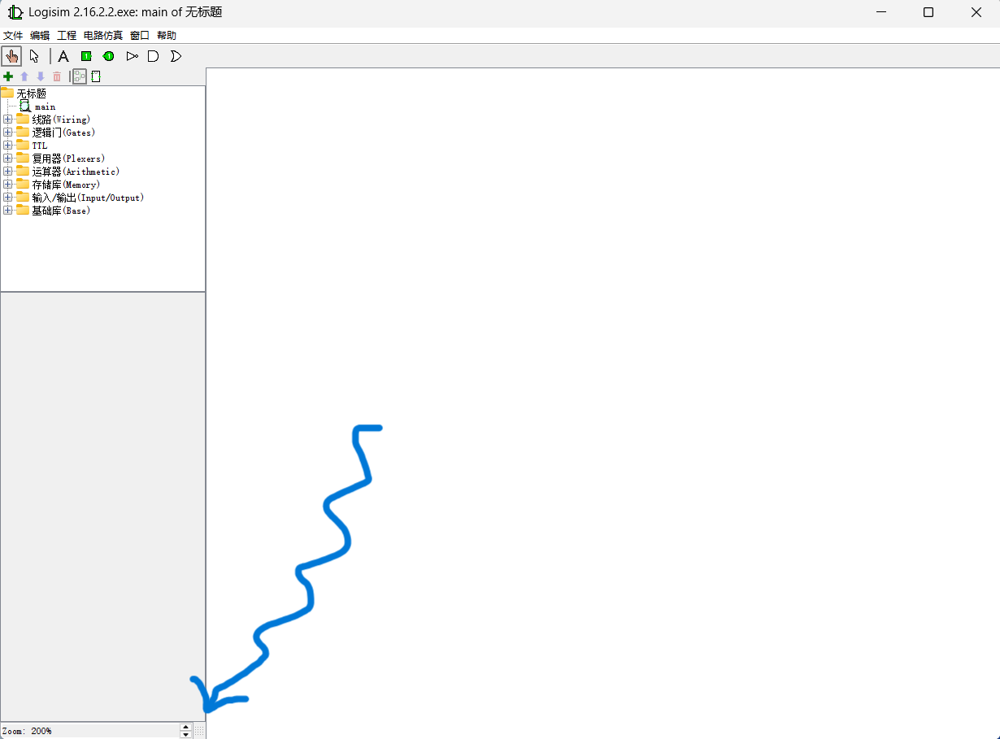

---

## Logisim 电路排查指南

你可以按照以下步骤排查你的电路是否有问题（<del>以及是你的问题还是 Logisim 的问题</del>）：

1. **重启一次 Logisim** 可以解决 Logisim 偶发的渲染问题（尤其是出现莫名其妙的蓝线/红线时）
2. 优先排查出现蓝线/红线的地方，善用鼠标中键排查错误连线（早期很多连线问题都是不小心把两个输入端连接到了一起，这种错误通过鼠标中键可以很快排查）
3. 没有蓝线/红线但是样例测试不通过 → 针对出现错误输出的部分，对着原理图（如果有）或逻辑式排查问题，善用鼠标中键；如果是时序逻辑电路的话可能还要<u>考虑上升沿/下降沿问</u>题，错误的时钟边沿设置会产生难以排查的问题
4. 长时间找不到错误点也是很正常的，必要时要有推倒重来的勇气；在难以构建正确的电路时，可以在cslab的实践课程上寻找教程（确保你已经进行了足够多的思考）；真的走投无路的话可以尝试体会开源精神，**注意可能造成的后果自负**

---

最后祝连线愉快，<del>作为助教时隔半年多已经完全不会用 Logisim 了，用起来应该没有各位熟练</del>
