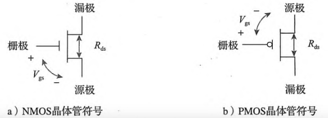
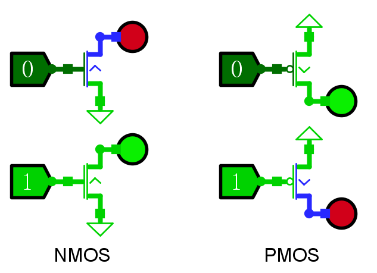
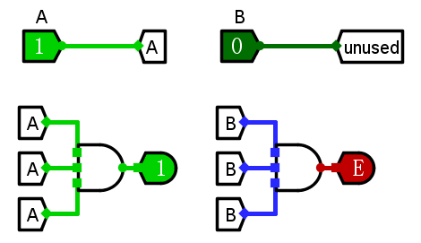

这里会将一些比较普遍、集中的问题汇总，如果这里什么都没写，说明<del>我忘记更新了</del>

---

## 三极管

在 Lab1.2 和 Lab1.4 中，有可能会遇到三极管相关的问题，比如：

> 我的 NMOS 管是不是放反了？

这两张图应该可以较好的解决疑惑

> 图一：通常约定 NMOS 的源极在下方，PMOS 的源极在上方。可以简单的解释为：NMOS 的源极通常（向下）接地，而 PMOS 管的源极通常（向上）接电源
>
> 然而 Logisim 的默认方向不是这样的，对于 NMOS 管你需要转一下

> 图二：如果源极统一接电源的话，三极管的实际通电情况
>
> Logisim 中，**输入端为方形接口，输出端为圆形接口**
>
> **三极管的箭头表示源极 -> 漏极的方向**
>
> （当然 NMOS 管的源极一般是接地的，而不是像图中这样接电源的）

## 输入引脚和隧道

输入引脚是提供有效信号的；隧道的作用是“无线传输”，通过标签名来识别同源信号

